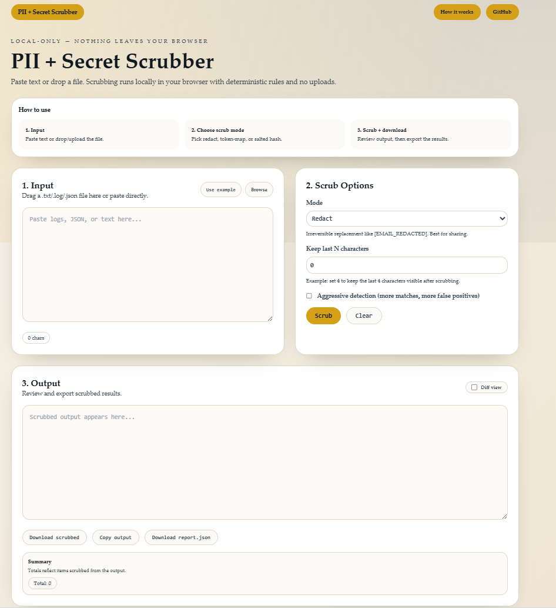

# Local-First PII + Secret Scrubber

Scrub sensitive data **entirely in your browser** - **no uploads**, **no telemetry**, **no analytics**.

**Live Site:** https://faheem-arif.github.io/pii-scrubber/

> Privacy promise: your input is processed locally (Web Worker). The app does not send your content to any server.

---

## Screenshot



---

## What it does

- Paste text or drop a `.txt` / `.log` / `.json` file
- Detect common PII + secrets using deterministic rules
- Scrub using one of three modes (redact / token-map / hash)
- Export scrubbed output + `report.json` (and `mapping.jsonl` for token-map)

---

## Scrub modes

- **Redact (recommended for sharing):** irreversible placeholders (e.g., `[EMAIL_REDACTED]`)
- **Token-map (traceable):** replaces values with stable tokens per run (e.g., `[[EMAIL:1]]`) and generates `mapping.jsonl`
- **Hash (linkable):** salted SHA-256 digests for consistent, non-reversible identifiers: `TYPE_SHA256:<digest>`

**Token-map warning:** `mapping.jsonl` contains original sensitive values. Treat it like a secret (encrypt at rest, don't share unless necessary).

---

## Detectors (v1)

Deterministic detectors (regex + structural validation + entropy heuristics), including:

- **PII:** email, IPv4/IPv6, UUID, URL basic auth
- **Secrets:** JWT, PEM private keys, GitHub tokens, AWS access keys, high-entropy secrets (keyword-adjacent)

---

## Usage (Web)

1. Open the site: https://faheem-arif.github.io/pii-scrubber/
2. Paste text or drop a file
3. Choose a mode and click **Scrub**
4. Download:
   - scrubbed output
   - `report.json`
   - `mapping.jsonl` (token-map only)

Notes:
- Diff view helps you review changes quickly.
- UI warns above 5MB and caps at 25MB in v1.

---

## Development

### Install
```bash
pnpm install
```
Note: If `pnpm` is not on your PATH, use `corepack pnpm` instead.
### Run (web)
```bash
pnpm --filter @pii-scrubber/web dev
```
### Tests
```bash
pnpm -w test
```
### Build
```bash
pnpm -w build
```

#### Build notes: the web app uses Next.js static export (output: "export") and runs client-side.

## Limitations
- Heuristic detection; not guaranteed to catch all sensitive data. Always review before sharing externally.
- No OCR/document/image processing.
- No name/address detection (no NLP); limited to deterministic patterns listed above.
- No backend, accounts, or persistence.
- UI caps large files at 25MB in v1.

## Repo layout
- packages/core - scrubber engine (pure TypeScript, browser-safe)
- apps/web - Next.js UI (static export)
- fixtures - shared fixtures for core tests
- .github/workflows/ci.yml - CI pipeline
